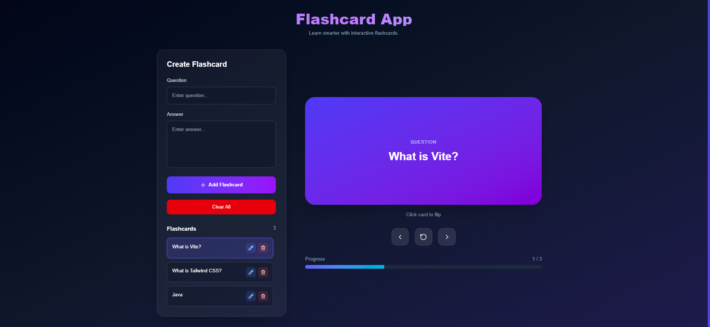
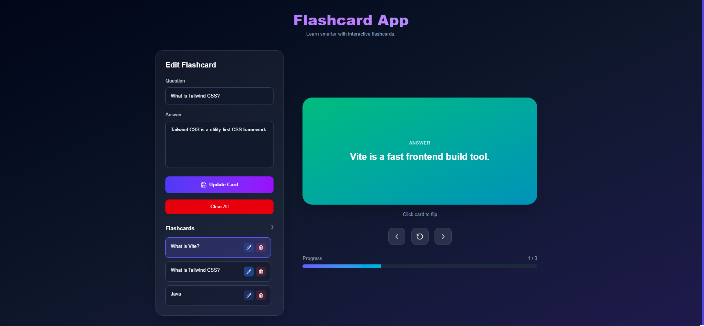

# 📚 Flashcard App

A modern and interactive Flashcard App built with **React (Vite)** to make learning more engaging. Create, edit, delete, and study flashcards with smooth animations and persistent storage.

## 🚀 Features

* Add new flashcards
* Edit existing flashcards
* Delete flashcards
* Clear all flashcards
* Flip card animation
* Previous and next navigation
* Progress indicator
* LocalStorage support
* Responsive dashboard layout
* Smooth animations with Framer Motion

## 🛠️ Tech Stack

* React (Vite)
* Tailwind CSS
* Framer Motion
* Lucide React
* LocalStorage

## 📦 Installation

```bash
npm install
npm run dev
```

## 📸 Screenshots

### Dashboard



### Study Mode


### Add & Manage Flashcards




## 💾 LocalStorage

Flashcards are stored in LocalStorage and remain available even after refreshing the browser.
